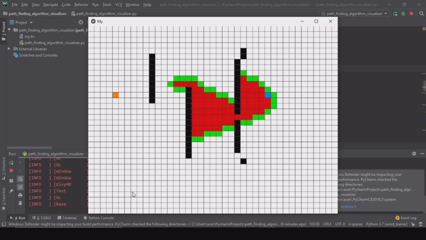

# path_finding_algorithm_visualizer
Kivy application for visualizing pathfinding algorithms, it implements A* search algorithm.

  

### Dependencies:

- [Kivy](https://github.com/kivy/kivy) >= 2.0.0 ([Installation](https://kivy.org/doc/stable/gettingstarted/installation.html))
- [Python 3.6+](https://www.python.org/)

